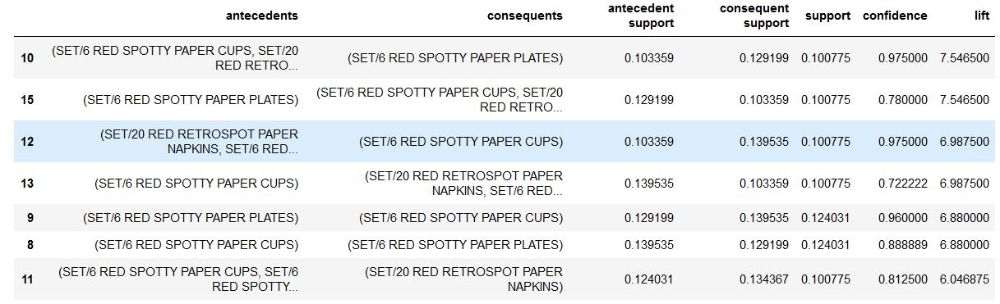

# Market Basket Analysis Case study
In this notebook, I explore how Market Basket Analysis (MBA) can be used to discover associations between items that are frequently used together. In this case, it is products that are being bought together in e-commerce transactions. But MBA can also be used in many other settings, for example to discover which websites are frequently visited together in the same session. 

In this notebook, I compare the speed of the simple Apriori Algorithm with that of the tree-based FP Growth. Both are algorithms for frequent pattern mining and yield the same results on the data used for this example.

